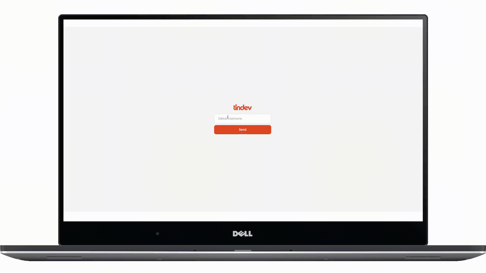
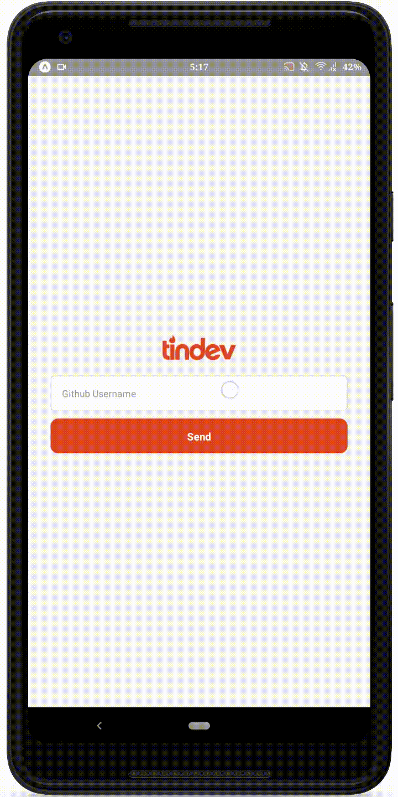

<h1 align="center">
  
</h1>
 
<h1 align="center">Tindev na Web</h1>

<strong>
  Com o Tindev, você pode encontrar os desenvolvedores na sua região,  e decidir se gosta ou não baseado no seu perfil, fazendo conexão em  realTime, quando ocorrer um Match, você será avisado na mesma hora :)
      Esse gif abaixo irá ser um bom exemplo 
   
  Feito com <a href="reactjs.org">ReactJS</a>, nossa aplicação é bem performatica e fluida no  ambiente de desenvolvimento e produção.
</strong>

 

<h1 align="center">Tindev Mobile</h1>

<strong>
  Feito completamente com <a href="https://facebook.github.io/react-native/">React Native</a> e uma ferramenta maravilhosa  chamada <a href="expo.io">Expo</a>, de forma nativa e performatica, também conta com  um fantastico RealTime pelo nosso amigo <a href="socket.io">Socket.io</a> tanto na web  quanto no Mobile, ambos os Gif's de exemplo feitos ao mesmo tempo.
</strong>

<h1 align="center">
  
</h1>

<h1 align="center">Por baixo dos panos</h1>

<strong>
Por ultimo mas não menos importante, a API Rest é feita com o nosso  amigão <a href="nodejs.org">NodeJS</a>, utilizando o <a href="expressjs.com">Express</a>, ele é o responsável pelas nossas  rotas na aplicação. 
Utilizando a solução em núvem <a href="cloud.mongodb.com">MongoDB Atlas</a>, nosso codigo é bem clean  e funcional, utilizando a API pública do nosso querido Github, os devs são  encontrados apenas com o Username do Github, isso é possível graças ao  fantástico <a href="https://github.com/axios/axios">Axios</a>, responsável por adquirir essas informações.
</strong>

<h1 align="center">Observações</h1>

Todos os usuários "cadastrados" nessa aplicação, tem o objetivo apenas  de testar a aplicação, todos os dados como Foto e Nome vem direto  do Github e eu não tenho acesso a modificações. 
  Este é um projeto original da <a href="https://github.com/Rocketseat">@Rocketseat</a>

 
